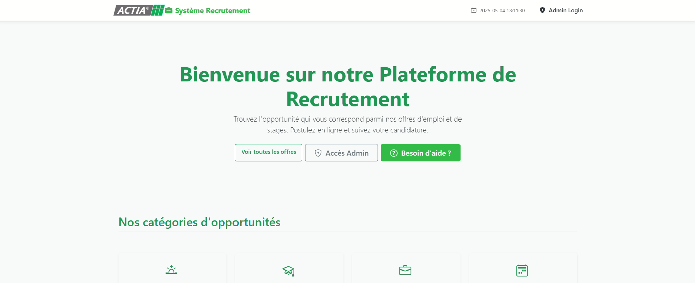
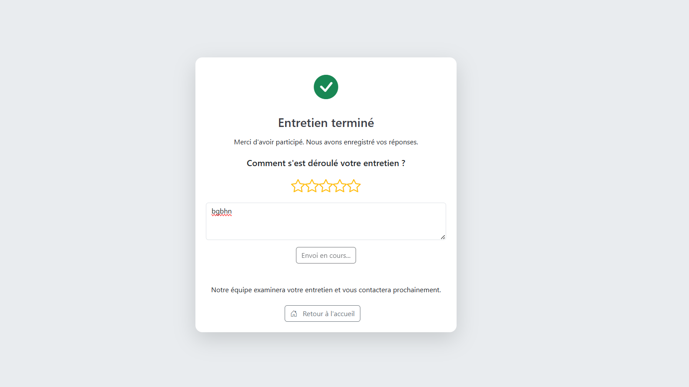

# AI-Powered HR Platform

A comprehensive full-stack platform for HR professionals to manage recruitment, from job posting to AI-driven interviews with emotion detection, developed with a focus on automation and enhanced candidate experience.

## Overview

This project was developed to explore advanced HR technology solutions at **Esprit School of Engineering**. It aims to streamline the entire candidate lifecycle by integrating an admin dashboard, a chatbot assistant to answer candidates queries, automated communications, and an AI virtual interviewer. The platform emphasizes efficiency and data-driven insights for modern recruitment.

---

``

---

## Features

*   **Admin Dashboard**:
    *   Manage job offers: Create, edit, and publish job postings.
        
    *   View and filter candidate applications.
        
    *   Select candidates and send them emails. 
        

*   **Chatbot**:
    *   Provides instant 24/7 responses to applicant queries regarding job details, company information, and application status.
        

*   **Automated Email System**:
    *   Streamlines communication with candidates via automated, templated emails for application confirmations, interview invitations, status updates, and rejection notifications.
       


*   **AI Virtual Interviewer**:
    *   Conducts interactive screening or technical interviews using voice and text.
        
    *   Real-time interaction via **WebSockets**.
    *   Generates comprehensive interview reports.
        
    *    Post-interview feedback to enhance candidate experience and provide actionable insights.
        
    
*   **Speech-to-Text & Text-to-Speech**: For natural conversational flow during AI interviews.

---

## Tech Stack

*   **Frontend**: HTML/CSS /JavaScript
*   **Backend**: Python, Flask, Flask-SocketIO
---

## Acknowledgments

This project was developed by DEEPCODE TEAM at **Esprit School of Engineering**.

*   Utilizes various open-source libraries and frameworks including Flask, OpenCV. Copyrights belong to their respective owners.
*   Emotion detection capabilities are for advanced insights and must be used ethically, transparently, and with candidate consent.

---
*README Last Updated: 2025-05-18 by @Maryem-Jlassi*
```
